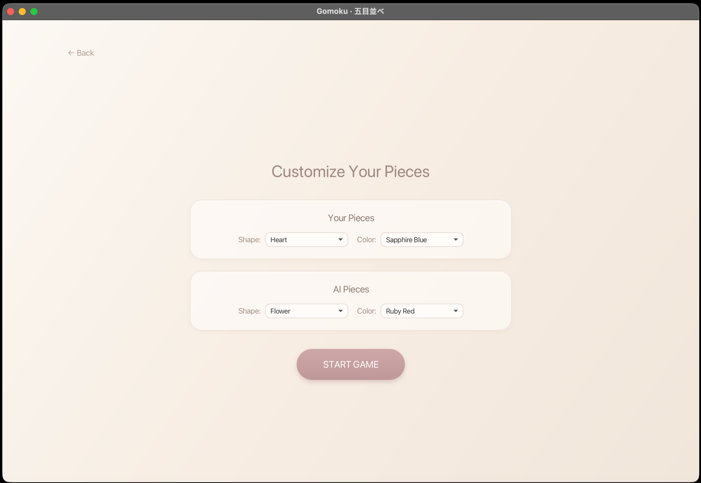
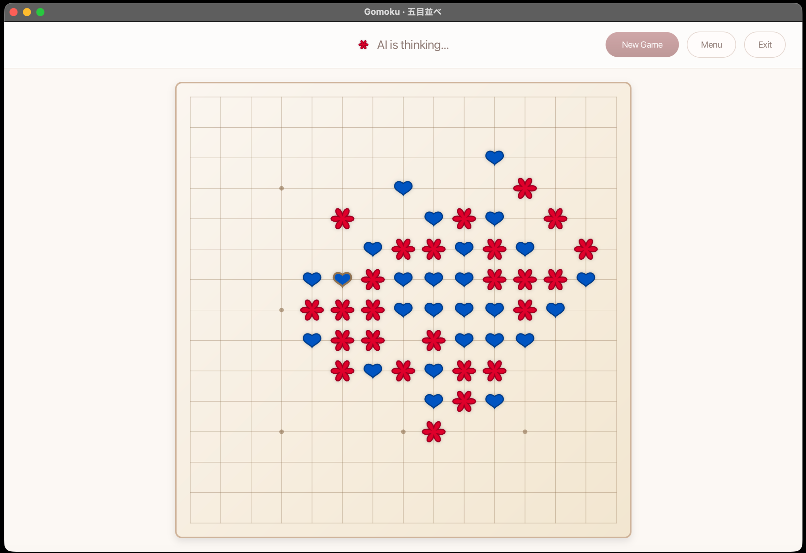
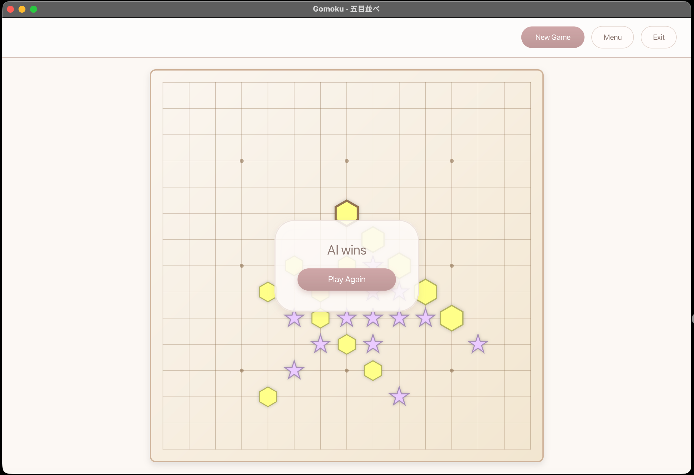

# Gomoku AI (五目並べ) — Intelligent Strategy Game


**Gomoku AI** is a high-performance, modern implementation of the classic strategy game "Five in a Row". This project fuses a premium, responsive **JavaFX** interface with a robust algorithmic core designed to challenge competitive players.

The interface features a sophisticated **"Dusty Rose & Warm Beige"** palette, inspired by Japandi minimalism, ensuring a calming yet engaging user experience.
---

## 📸 Gallery & Interface

The interface features a sophisticated **"Dusty Rose & Warm Beige"** palette, inspired by Japandi minimalism.

| **Smart Customization** | **AI in Action** | **Victory & Analysis** |
|:---:|:---:|:---:|
|  |  |  |
| *Choose unique shapes like Hearts and Stars. The system prevents color conflicts.* | *Responsive board showing the "AI is thinking..." state during complex calculations.* | *Clean victory screen highlighting the winning line (AI wins in this match).* |

---


## 🏗️ System Architecture

The project follows the **Clean Architecture** principles and the **MVC (Model-View-Controller)** pattern to ensure separation of concerns and maintainability.

| Component | Technology | Description |
| :--- | :--- | :--- |
| **Game Engine** | Java Core | Manages the game loop, turn switching, and rule enforcement (`Game.java`, `GameLogic.java`). |
| **AI Core** | Minimax / Heuristics | The decision-making engine. Utilizes Alpha-Beta pruning and threat space search to calculate moves in <1s (`MinimaxAI.java`). |
| **UI Rendering** | JavaFX / Vector | Adaptive rendering using vector graphics (`Shapes`) and scale transformations for perfect quality at any window size. |
| **Concurrency** | JavaFX Task | AI calculations are offloaded to background threads to ensure the UI remains fluid (60 FPS) during computation. |

---

## 🛠️ Engineering Challenges & Solutions

### 1. Combinatorial Explosion (15x15 Board)
**Challenge:** A standard Gomoku board offers ~225 possible moves at the start. A naive Minimax algorithm cannot search deep enough within a reasonable time frame.
**Solution:** Implemented a **Threat Space Search** module (`ThreatSpaceSearch.java`). Before the general search, the AI specifically scans for "forcing" moves (immediate wins, blocks, or creating open fours). This reduces the branching factor in critical states from ~200 to just 5-10 relevant moves.

### 2. UI Responsiveness & Threading
**Challenge:** Heavy AI computations can block the JavaFX Application Thread, causing the interface to freeze or become unresponsive.
**Solution:** All AI logic is encapsulated within `javafx.concurrent.Task`. The game loop triggers the AI in a background thread, while UI updates (placing pieces, animations) are scheduled back on the UI thread via `Platform.runLater()`.

### 3. Adaptive Vector Graphics
**Challenge:** Maintaining visual fidelity and correct hit-testing coordinates when the application window is resized.
**Solution:** Instead of raster images, the board uses JavaFX vector shapes (`Polygon`, `Circle`). A `Scale` transform is applied to the root `BoardPane`, calculating the optimal zoom factor dynamically to fit the window while preserving aspect ratio.

---

## ✨ Key Features

* **Responsive UI:** The game board smoothly scales to fit any screen size without losing quality.
* **Smart Customization:** Players can select piece shapes (Star, Heart, Gem, etc.) and colors. The system includes logic to prevent color conflicts between the player and AI.
* **Smooth Animations:** Transitions between screens and moves are animated using `FadeTransition` and `ScaleTransition` for a polished feel.
* **Clean Code:** The codebase is structured for readability and extensibility, with comprehensive Javadoc documentation.

---

## 🚀 Quick Start

The project is fully configured with Gradle Wrapper. No manual JavaFX installation is required.

### Prerequisites
* JDK 17 or higher.

### Installation

1.  **Clone the repository:**
    ```bash
    git clone https://github.com/kelemano/gomoku-ai.git
    cd gomoku-ai
    ```

2.  **Run the application:**
    * **Windows:**
        ```bash
        gradlew.bat run
        ```
    * **macOS / Linux:**
        ```bash
        ./gradlew run
        ```

---

## 📂 Project Structure

```text
gomoku-ai/
├── src/main/java/com/gomoku/
│   ├── Main.java              # Application Entry Point
│   ├── GomokuGUI.java         # Main View & UI Logic
│   ├── WelcomeScreen.java     # Menu & Customization Screens
│   ├── Game.java              # Game Controller
│   ├── GameLogic.java         # Rules & Win Detection
│   ├── Board.java             # Data Model (Grid State)
│   ├── MinimaxAI.java         # AI Algorithm (Minimax + AlphaBeta)
│   ├── ThreatSpaceSearch.java # AI Optimization Logic
│   ├── Evaluator.java         # Heuristic Evaluation Function
│   └── PieceSettings.java     # Visual Configuration (Shapes/Colors)
├── src/main/resources/
│   └── style.css              # Custom CSS Styling
└── build.gradle               # Build Configuration
